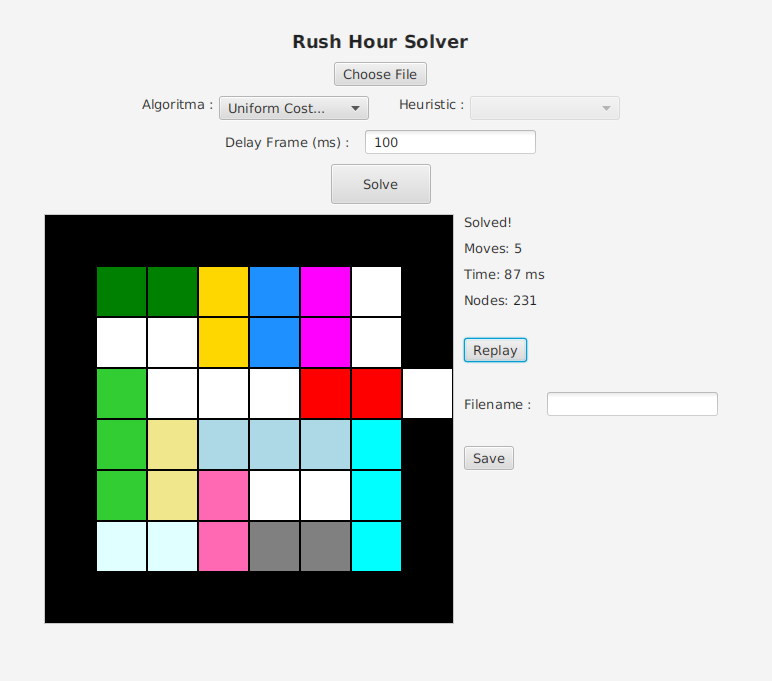

# Tucil3_13523126_13523154

> 🧠 Tugas Kecil 3 IF2211 Strategi Algoritma

# 🚗 Puzzle Rush Hours Solver

This project is a solver for the classic Rush Hour puzzle game. It utilizes various pathfinding algorithms to find the optimal sequence of moves to solve a given puzzle configuration. The program features a graphical file input dialog for easy selection of puzzle files, supports both Windows and Linux operating systems, and provides a user-friendly interface for selecting algorithms and saving solutions. The implementation is modular, making it easy to extend or modify the algorithms used.

## 🖼️ Overview

### Actually better lookin ahh output (CLI di branch)
  

## Main Feature

- 🔍 **Pathfinding Algorithms**  
  Solve the puzzle using:
  - UCS (Uniform Cost Search)
  - Best First Search
  - A* Search 

  Best First Search and A* provides multiple solution with different heuristics

- 🖥️ **GUI Visualization**  
  Animated solution steps with **colored output** and clear directions.   
    Delay frames are adjustable to your liking. 

- ⏮️ **Replay Solution**   
  Solution steps can be replayed as many times as you want.

- 💾 **Save Solution**  
  Save step-by-step solutions to a `.txt` file in the `test/` folder.

## ⚙️ Requirement

- Java Development Kit (JDK) V8.0 or above.
- Windows and Linux operating systems.
- JavaFX.
- Apache Maven.
- IDE (Eclipse, VSCode, etc.)

## 🛠️ How to run

Run the file using the command line on CLI (Command Prompt / Powershell / Git Bash / WSL) :

**Windows & Linux**

```sh
mvn clean compile
mvn javafx:run
```

## Project Structure

```
TUCIL3_13523126_13523154
├── doc/
├── src/
│   └── main/
│       ├── java/
│       │   └── module-info.java
│       │   └── rushhours/
│       │       ├── algorithm/
│       │       │   ├── AStar.java
│       │       │   ├── BestFirstSearch.java
│       │       │   └── UCS.java
│       │       ├── control/
│       │       │   └── App.java
│       │       │   └── MainController.java
│       │       ├── io/
│       │       │   ├── LoadFile.java
│       │       │   └── WriteFile.java
│       │       └── model/
│       │           ├── Board.java
│       │           ├── Coordinate.java
│       │           ├── Piece.java
│       │           ├── PieceMap.java
│       │           ├── State.java
│       │           └── Colors/
│       │               ├── Color.java
│       │               └── ColorMap.java
│       └── resources/
│           └── primary.fxml
├── test/
├── .gitignore
├── pom.xml
└── README.md
```

## Author

<table>
  <tr>
    <th>Name</th>
    <th>NIM</th>
  </tr>
  <tr>
    <td>Brian Ricardo Tamin</td>
    <td>13523126</td>
  </tr>
  <tr>
    <td>Theo Kurniady</td>
    <td>13523154</td>
  </tr>
</table>
