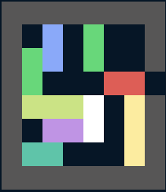

# Tucil3_13523126_13523154

> 🧠 Tugas Kecil 3 IF2211 Strategi Algoritma

# 🚗 Puzzle Rush Hours Solver

This project is a solver for the classic Rush Hour puzzle game. It utilizes various pathfinding algorithms to find the optimal sequence of moves to solve a given puzzle configuration. The program features a graphical file input dialog for easy selection of puzzle files, supports both Windows and Linux operating systems, and provides a user-friendly interface for selecting algorithms and saving solutions. The implementation is modular, making it easy to extend or modify the algorithms used.

## 🖼️ Overview
 

## Main Feature

- 🔍 **Pathfinding Algorithms**  
  Solve the puzzle using:
  - UCS (Uniform Cost Search)
  - Best First Search
  - A* Search
  
- 🖥️ **Terminal Visualization**  
  Animated solution steps with **colored output** and clear directions.

- 💾 **Save Solution**  
  Save step-by-step solutions to a `.txt` file in the `test/` folder.

## ⚙️ Requirement

- Java Development Kit (JDK) V8.0 or above.
- Windows and Linux operating systems.
- Graphical environment (GUI) required:  
  The program uses a file explorer dialog (input pop-up) for selecting input files.  
  Please run this program on a desktop environment such as Windows, GNOME, KDE, or any Linux desktop.  
  Do not run in a terminal-only or SSH session, as the input dialog will not appear.

## 🛠️ How to run

Run the file using the command line on CLI (Command Prompt / Powershell) :

**Windows**

```sh
./run.bat
```

**Linux**

```bash
make run
```

## Project Structure

```
├── .gitignore
├── Makefile
├── README.md
├── run.bat
├── doc/
├── src/
│   └── main/
│       └── java/
│           └── rushhours/
│               ├── Main.java
│               ├── algorithm/
│               │   ├── AStar.java
│               │   ├── BestFirstSearch.java
│               │   └── UCS.java
│               ├── io/
│               │   ├── LoadFile.java
│               │   └── WriteFile.java
│               └── model/
│                   ├── Board.java
│                   ├── Coordinate.java
│                   ├── Piece.java
│                   ├── PieceMap.java
│                   ├── State.java
│                   └── Colors/
│                       ├── Color.java
│                       └── ColorMap.java
└── test/
```

## Author

<table>
  <tr>
    <th>Name</th>
    <th>NIM</th>
  </tr>
  <tr>
    <td>Brian Ricardo Tamin</td>
    <td>13523126</td>
  </tr>
  <tr>
    <td>Theo Kurniady</td>
    <td>13523154</td>
  </tr>
</table>
